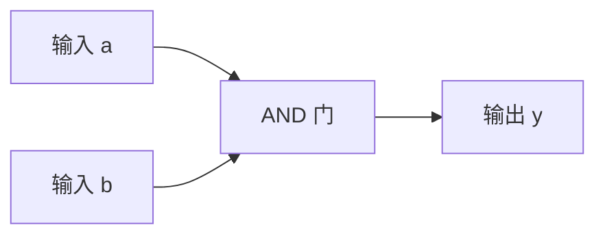
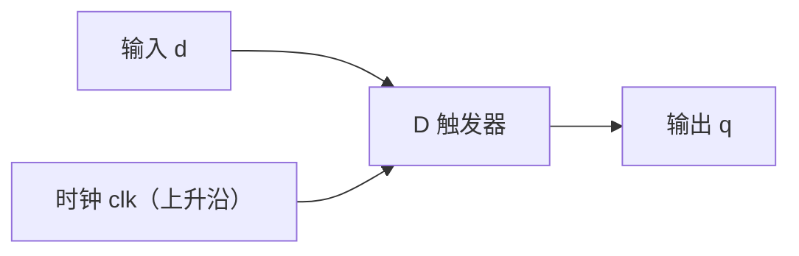

# D1 学习笔记

## 1. AND 组合逻辑

我的理解：

a b 均为1时y才为1，不需时钟，组合逻辑。

## 2. D 触发器

我的理解：

q 只在 clk 上升沿到来的瞬间采样 d，之后保持这个值，直到下一个上升沿。两个上升沿之间即使 d 改变，q 也不会跟着改变。“上一拍”是指在下一个上升沿到来之前，q 保存的是上一个上升沿采到的 d。

## 3. Module 与端口

我的理解：

1. module 定义是一种可复用的电路蓝图，它规定了 input、output 等端口和内部电路结构。模块内部可以包含 wire、assign，以及其他模块的实例。

2. 模块实例是根据某个 module 定义放置的一份具体电路。同一个模块可以实例化多次，例如 u1、u2；每个实例有自己的名称、端口连接和内部状态，并且同时工作。

3. 在 .in1(a) 中，in1 是子模块声明的端口名，a 是当前父模块中的信号。这句话表示把父模块的信号 a 连接到该子模块实例的 in1 端口。